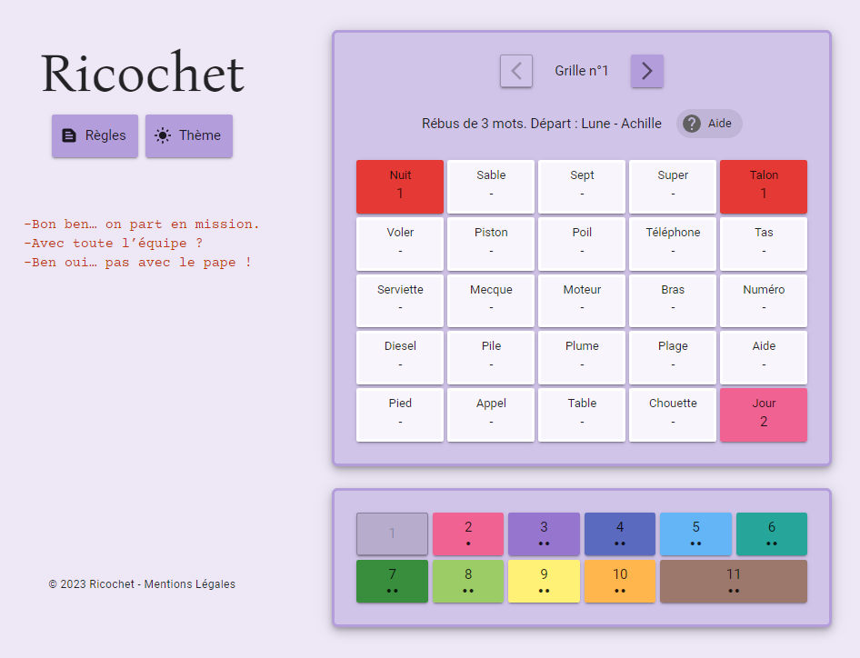
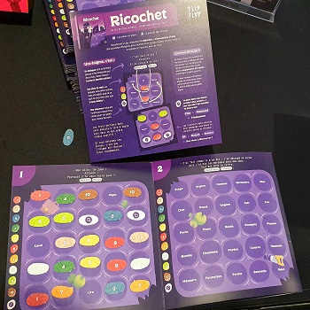

# Ricochet

Ricochet is a board game where you need associate words together to progress and finally find the secret end of a dialogue.

This project is a reproduction of a real board game created by Cyril Blondel. It intends to be a tribute to his work and I hope some people will have as much fun as I had playing this game.

## Try the game

- A live version of the project is available here: [ricochet.belkross.com](https://ricochet.belkross.com/)

- You can get a physical version of the game here: [flipflapeditions.fr](https://www.flipflapeditions.fr/jeux-ricochet/)

You need to speak french and have some knowledge about french culture to play this game because it rely on french expressions and references. Teammates are allowed and strongly recommended for their additionnal general culture, and for the fun of course !

## Built with

- [Typescript](https://www.typescriptlang.org/) - Javascript language superset
- [React](https://en.reactjs.org/) - user interface Javascript library
- [Mui](https://mui.com/) - components and styling React library

## Deployment

To run this project in your local machine, use the following commands in your terminal:

1. clone the project: `git clone <Github’s repository URL>`
2. move to the project folder: `cd ricochet`
3. install dependencies: `pnpm install`
4. launch the app locally: `pnpm run dev`

The app is now available in your web navigator here: http://localhost:5173
